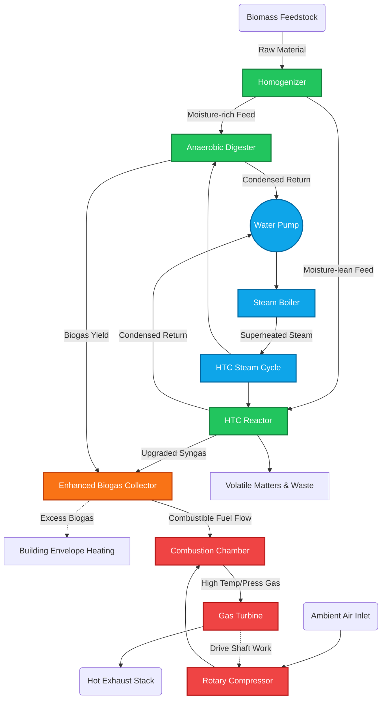

# ⚡ AD-HTC Fuel-Enhanced Gas Cycle Dashboard

An advanced, premium thermodynamic simulator integrating **Anaerobic Digestion (AD)** and **Hydrothermal Carbonization (HTC)** into a **Fuel-Enhanced Brayton Gas Cycle**. This application provides a full-stack engineering interface for evaluating, optimizing, and visualizing hybrid biomass-to-power generation systems.

It features **Aura**, a built-in AI Copilot providing dynamic engineering insights, thermodynamic stability checks, and real-time operational advice directly inside your dashboard.

---

## 🌟 Key Features

1. **Integrated Thermodynamic Core Engine:**
   - **Brayton Gas Cycle:** Live calculations of compressor, combustor, and turbine states.
   - **Rankine Steam Cycle:** High-fidelity steam tables calculating enthalpies and entropies using CoolProp.
   - **HTC & AD Balance:** Integrated moisture processing and biogas yield mapping.

2. **Advanced Interactive Visualizations:**
   - **Animated Flow Schematic:** Dynamic visual mapping of all fluid pathways, components, and real-time state parameters, mimicking a professional SCADA interface.
   - **h-s Diagram:** Mollier diagram (Enthalpy-Entropy) tracking steam expansion.
   - **T-Q Profile:** Heat exchange matching mapping the Brayton exhaust to HTC heat demand.
   - **Exergy Destruction Chart:** Sankey/Waterfall tracking real thermodynamic losses.

3. **Aura - Premium AI Engineering Copilot:**
   - Floating, glassmorphic UI interface.
   - Uses Gemini LLM to interpret simulation results instantaneously.
   - Pre-programmed "Engineering Flags" (🟢 Stable, 🟡 Risk, 🔴 Critical).
   - Solid high-contrast readability and premium animated toggles.

---

## 🏗️ System Schematic Architecture

The following diagram maps out how the components of this integrated software stack communicate thermodynamically:



> **Note:** Explore the interactive digital version of this schematic under the "Show Report" tab in the live application! Click the animated node points to view live cycle constraints (`T` `P` `h` `s`).

---

## ⚙️ Installation Instructions

**1. Clone the repository**
Download or clone this project folder to your local machine:
```bash
git clone <your-repo-link>
cd ad-htc-fuel-enhance-cycle
```

**2. Ensure you have Python installed**
You will need Python `3.9+`. You can check your version by running `python --version` in your terminal.

**3. Install requirements**
Install the thermodynamic physics libraries and visualization engines:
```bash
pip install -r requirements.txt
```

*(Note: The `requirements.txt` installs `streamlit`, `pandas`, `plotly`, `CoolProp`, and `google-generativeai` among other core dependencies)*

**4. Set up AI Copilot (Optional but recommended)**
A hard-coded developer key powers **Aura** initially. In a production environment, expose your Gemini API key via Streamlit secrets:
```bash
# In .streamlit/secrets.toml
GEMINI_API_KEY = "Your-API-Key"
```

---

## 🚀 Running the Application

Open your command line and run:

```bash
streamlit run app.py
```

The application will launch directly into your browser at `http://localhost:8501`. 

### How to use the Interactive Interface:
1. Turn to the **LEFT SIDEBAR Input Form**.
2. Twist the sliders to modify parameters for the **Gas** cycle (pressure ratio, limits), **Steam** cycle (boiler pressure), and **AD** operations.
3. Click the bright blue **▶ ANALYZE SYSTEM** button.
4. Access **Aura**, your AI copilot, gracefully floating in the bottom-right corner `✨`. Ask her questions regarding system risks or efficiency improvements.

---

## 📁 Directory Structure Breakdown

```text
/
├── app.py                      # Main Streamlit executable script
├── requirements.txt            # Package dependencies
├── core/
│   ├── ai_assistant.py         # Google Gemini LLM API routing & prompt handling
│   ├── brayton.py              # Brayton Gas Cycle thermodynamic models
│   ├── htc_balance.py          # Heat and mass balance for the HTC + AD modules
│   ├── reports.py              # Data aggregation scripts
│   └── steam_states.py         # CoolProp physics linking for Rankine saturation
├── ui/
│   ├── schematic.py            # Generates the highly interactive HTML SCADA schematic
│   └── styles.py               # Houses the premium custom Dashboard CSS and layouts
├── utils/
│   └── constants.py            # Global thermodynamic variables (R, Cp, Gamma)
└── visualization/
    ├── energy_flow.py          # Plotly Sankey and Power bars
    ├── exergy_diagram.py       # Exergy destruction and losses waterfalls
    ├── hs_diagram.py           # Enthalpy-Entropy Steam expansion plotting
    └── tq_diagram.py           # Heat exchange curves (Temperature vs Heat mapping)
```

---

*Designed for high-end thermodynamic analysis and fluid process modeling.*
